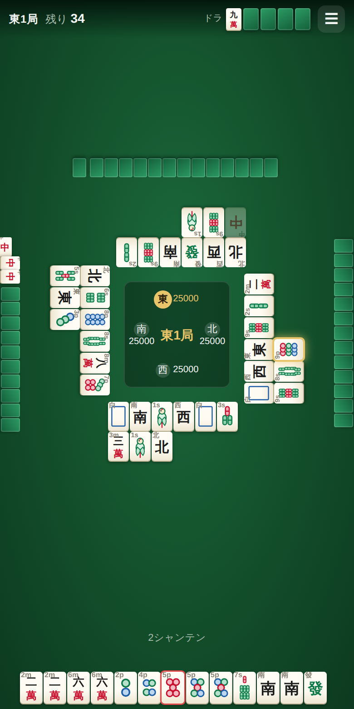

# スマホ麻雀 — 四人打ちリーチ麻雀

スマートフォンのブラウザだけで遊べる日本式リーチ麻雀（四人打ち）です。
インストール不要、サーバ不要。ページを開けばそのまま CPU 3 人と対局できます。



## 特徴

- **モバイルファースト** — 縦持ち前提のレイアウト。牌は指で押しやすい大きさで、
  セーフエリア（ノッチ・ホームバー）にも対応。
- **画像アセットなし** — 34 種類の牌はすべて SVG で描画するので、
  どんな解像度でもぼやけません。ビルド成果物は 100KB 台。
- **オフライン対応（PWA）** — 一度開けば Service Worker がキャッシュするので、
  電波のない場所でも遊べます。ホーム画面に追加すればフルスクリーンで起動します。
- **本格的なルール処理** — 立直・一発・裏ドラ・赤ドラ・槍槓・嶺上開花・
  九種九牌・四風連打・流し満貫・フリテン・喰い替え禁止・ダブロンなどに対応。
- **初心者向けの補助表示** — シャンテン数と待ち牌、フリテン警告、牌の数字ラベルを
  表示できます（設定でオフにできます）。

## 遊び方

1. タイトル画面で「対局開始」。
2. 自分の番になったら手牌をタップして捨て牌を選びます
   （既定では 1 回目のタップで選択、2 回目で確定。設定で 1 タップ即切りにもできます）。
3. 鳴きや和了ができるときは右下にボタンが出ます。
   **ロン / ツモ / リーチ / ポン / チー / カン / パス** から選んでください。
   リーチはボタンを押してから捨てる牌を選びます（もう一度押すと取り消し）。
4. ドラ表示牌は画面上部、点数・局・供託は卓の中央に表示されます。

## 設定

| 項目 | 内容 |
|:--|:--|
| 対局 | 東 1 局のみ / 東風戦 / 半荘戦 |
| 赤ドラ | 五萬・五筒・五索を 1 枚ずつ赤牌にする |
| クイタンあり | 鳴いた断幺九を認める |
| 進行速度 | 速い / 普通 / ゆっくり |
| 打牌の確認 | 2 タップで確定するかどうか |
| 牌に数字を表示 | 「3p」のような補助ラベル |
| アシスト表示 | シャンテン数と待ち牌 |
| 効果音 | WebAudio で合成（音声ファイルなし） |

設定は `localStorage` に保存されます。

## 開発

```sh
npm install
npm run dev        # 開発サーバ（--host 付きなので実機からもアクセスできます）
npm run build      # dist/ に静的ファイルを生成
npm run preview    # ビルド結果の確認
npm test           # ルール処理・牌姿解析のテスト
```

実機で確認するときは `npm run dev` が表示する `Network:` の URL を
スマートフォンのブラウザで開いてください。

### 構成

```
index.html
src/
  main.js        タイトル画面・設定・対局の起動
  ui.js          卓の描画とプレイヤー操作（Majiang.Player の View）
  human.js       人間の対局者（Majiang.Player を継承し UI の入力を待つ）
  tiles.js       34 種類の牌を SVG で描画
  render.js      牌・面子の DOM 生成
  pai.js         牌姿・面子の解析（副露の並べ方、点数の格、局名）
  settings.js    設定の保存とルール変換
  sound.js       WebAudio による効果音の合成
test/            ルール処理と牌姿解析のテスト
```

描画は「自分の視点の卓情報」(`Majiang.Board`) だけを参照しているため、
他家の手牌が画面に出ることはありません。

## デプロイ

`main` ブランチに push すると GitHub Actions が `dist/` を GitHub Pages に公開します
（リポジトリの Settings → Pages で Source を **GitHub Actions** にしてください）。
`base` は相対パスなので、サブディレクトリ配信でもそのまま動きます。

## 使用している OSS

| ライブラリ | 用途 | ライセンス |
|:--|:--|:--|
| [@kobalab/majiang-core](https://github.com/kobalab/majiang-core) | 手牌操作・シャンテン数計算・和了点計算・局進行 | MIT |
| [@kobalab/majiang-ai](https://github.com/kobalab/majiang-ai) | CPU の思考ルーチン（電脳麻将） | MIT |
| [Vite](https://vitejs.dev/) | ビルド・開発サーバ | MIT |
| [vite-plugin-pwa](https://vite-pwa-org.netlify.app/) | Service Worker と manifest の生成 | MIT |

麻雀のルール処理と CPU は [Satoshi Kobayashi](https://github.com/kobalab) 氏による
**電脳麻将** のライブラリをそのまま利用しています。
本リポジトリのコードは UI と、その上でのゲーム進行の組み立てを担当しています。

## ライセンス

MIT License（[LICENSE](LICENSE) を参照）
